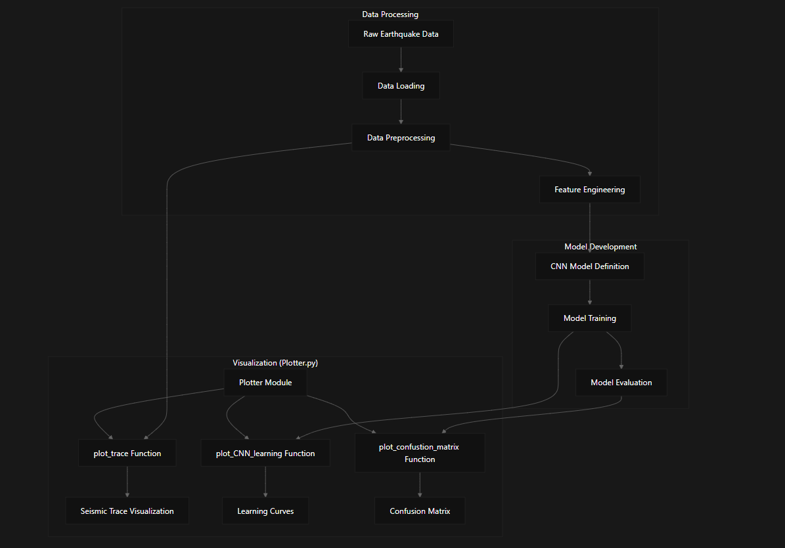

# Multiclass Classification with CNN

This repository implements a Convolutional Neural Network (CNN) for multiclass classification of earthquake data. The system processes seismic traces and classifies them into multiple categories, with tools to visualize the data and evaluate model performance

This work was motivated by the [g2net 2020 Hackathon](https://indico.ego-gw.it/event/46/overview) .

