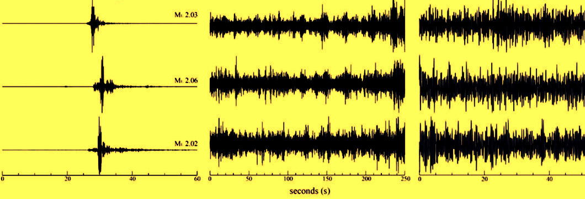

# Multiclass Classification with CNN

This is a notebook where I perform a Multiclass Classification task using Convolutional Neural Networks.

This work was motivated by the [g2net 2020 Hackathon](https://indico.ego-gw.it/event/46/overview) .

